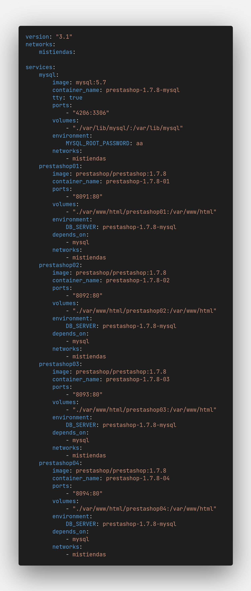
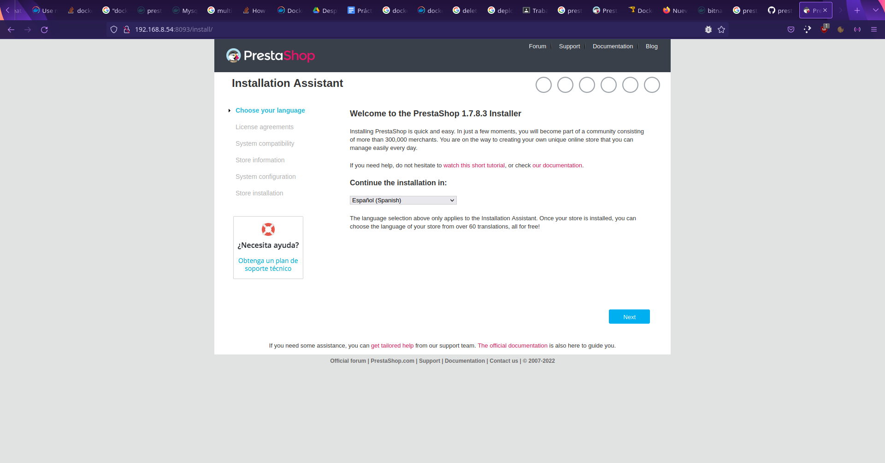
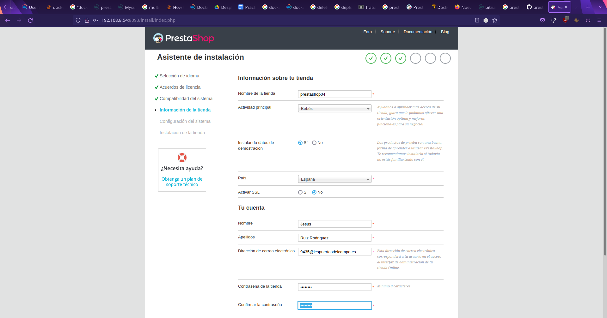
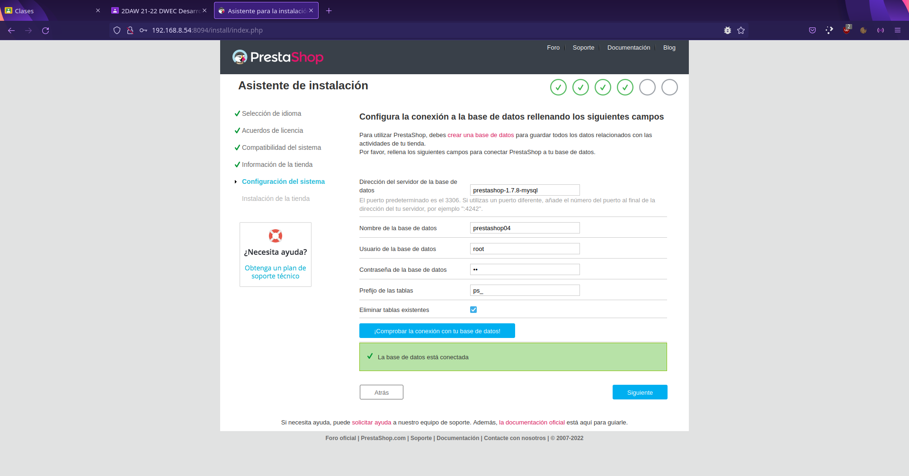
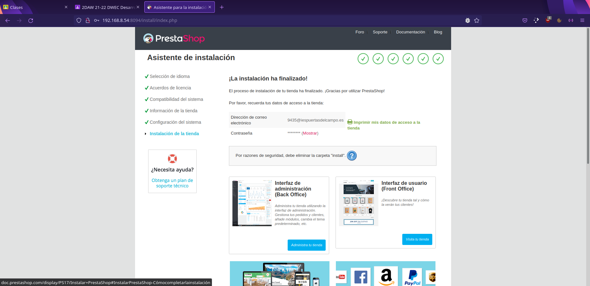
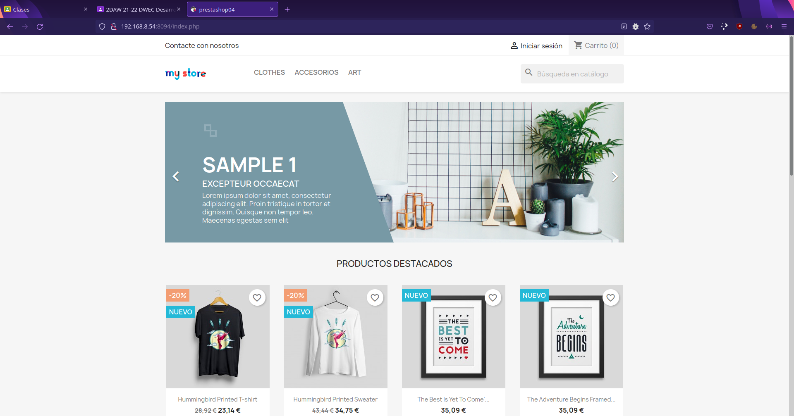
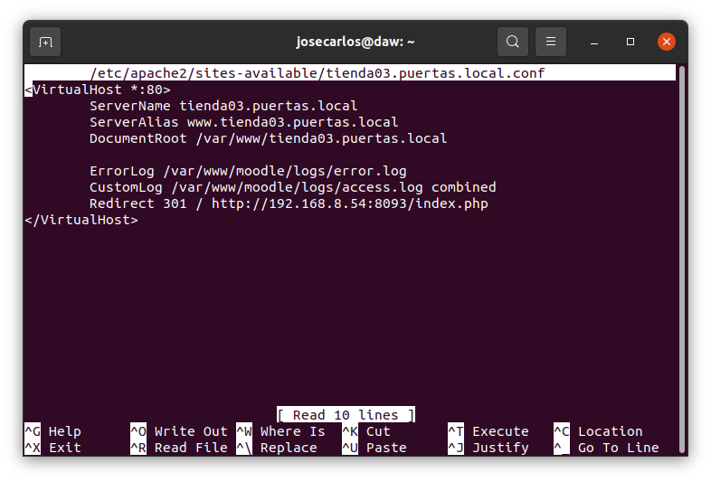

### Práctica Final Despliegue de Aplicaciones Web

Esta página web estática contiene todas las tareas que hemos ido realizando en la práctica sobre el servidor de la clase.

## Listado de Componentes Necesarios y sus Responsables

- [Apache HTTPD Server](#httpd)
_Realizado por Emilio_

- [Apache Tomcat](#tomcat)
_Realizado por José Carlos_

- [Docker](#docker)
_Realizado por Jesús Ruiz y Jose Carlos_

- [FTP Server](#ftp)
_Realizado por Josema_

- [SSH](#ssh)
_Realizado por Jesús Roca_

- [PHP](#php)
_Realizado por Ahmed_

- [Mysql Server](#mysql)
_Realizado por Raúl Arce_

- [Github Page](#git)
_Realizado por Raúl Arce_

## Servidores a Desplegar | Requisitos

#### GLPI (Apache HTTP Server).
1. inventario.puertas.local
2. Sitio web seguro con certificado, sitio no seguro redirige al seguro.
3. Usuario: glpi, con contraseña glpi.Puertas que sirva para el usuario del
sistema (directorio home /var/www/glpi), FTP, SSH y para su base de datos
de MySQL.

---

#### Moodle (Apache HTTP Server).
1. cursos.puertas.local
2. Sitio web seguro con certificado, y sitio no seguro no redirige.
3. Usuario: moodle, con contraseña moodle.Puertas que sirva para el usuario
del sistema (directorio home /var/www/moodle), FTP, SSH y para su base de
datos de MySQL.

---

#### PHPMyAdmin.
1. mysql.puertas.local
2. Sitio web seguro con certificado, y sitio no seguro no redirige.
3. Usuario: bbdd, con contraseña mysql.Puertas que sirva para el usuario del
sistema (directorio home /var/www/phpmyadmin), FTP, SSH y para todas las
bases de datos de MySQL.

---

#### OpenCMS (Apache Tomcat).
1. opencms.puertas.local
2. Usuario: opencms, con contraseña opencms.Puertas que sirva para el
usuario del sistema, FTP, SSH y para su base de datos de MySQL.

---

#### Prestashop (imagen de Docker que genere una instancia de Prestashop con la creación de su base de datos al lanzar un contenedor). Generar cuatro tiendas.
1. tienda01.puertas.local
2. tienda02.puertas.local
3. tienda03.puertas.local
4. tienda04.puertas.local

---
---
---

<a name="httpd"></a>

## Apache HTTPD Server

<a name="tomcat"></a>

## Apache Tomcat
- Jose Carlos Vicario Cobos
  
#### Instalamos el servidor Tomcat y todos sus componentes mediante la terminal
   `sudo apt install tomcat9*`


#### Modificamos el puerto por el que trabaja Tomcat al 8081


#### Crear el usuario OpenCMS para Tomcat


#### Modificar el tamaño máximo de subida de Tomcat manager

Es necesario modificar el tamaño máximo de subida del manager de Tomcat; el tamaño por defecto es 50MB, mientras que el archivo .war de OpenCMS es de unos 250MB. Por lo tanto, hasta que no se modifique este límite no se podrá subir y desplegar la aplicación.


#### Subimos mediante el manager el archivo .war de OpenCMS


Y una vez subido, aparece desplegado con el resto de aplicaciones...


#### Crear un usuario para OpenCMS en MySQL, instalación del conector de Java para MySQL
OpenCMS necesita un usuario para crear y gestionar sus bases de datos, lo creamos mediante el terminal.


Además, para comunicar Java con MySQL, necesitamos instalar un conector específico. Para poder instalar este paquete, primero necesitaremos añadirlo con el comando

`sudo dpkg -i mysql-connector-java_8.0.28-1ubuntu21.10_all.deb`


#### Instalación de OpenCMS

Accedemos a la configuración con la ruta

`/opencms/setup`


Se nos muestran las opciones del servidor...


Conectamos OpenCMS con nuestra base de datos...


Esperamos a que se termine la instalación


Y, por último, se nos redirige a la página principal de OpenCMS


...Y añadimos un usuario opencms


#### Redireccionar OpenCMS del puerto 80 al 8081
- Jesús Roca Obispo

Deberemos crear un fichero dentro de /etc/apache2/sites-available/ llamado opencms.conf

El fichero debe contener las siguientes directivas:


Luego usamos el comando a2ensite para habiliar nuestra web:

`sudo a2ensite opencms.conf`

Y reiniciamos el servidor de apache:

`sudo systemctl reload apache2.service`

Por ultimo debemos acceder al fichero /etc/hosts y añadir la IP de nuestro servidor y el nombre de nuestro sitio virtual:

`192.168.9.195    opencms.com`

Para comprobar que funciona podemos ir a nuestro navegador y escibir en la barra:

`opencms.com`

<a name="docker"></a>

## Docker
- Jesús Ruiz Rodríguez

#### Creación de contenedores Prestashop con Docker

Hacemos un docker-compose en la que creamosuna red, una base de datos y 4 contenedores de Prestashop conectados a esa base de datos

_Prestashop_

*Nombre de la Red:* mistiendas
*Nombre de los contenedores de Prestashop:* prestashop-1.7.8-01, prestashop-1.7.8-02, prestashop-1.7.8-03, prestashop-1.7.8-04
*Nombre del contenedor de MySQL:* mysql
*Imagen Prestashop:* prestasho/prestashop:1.7.8
*Puertos prestashop:* 8090, 8091, 8092, 8093
*DB_server:* prestasho-1.7.8-mysql

_MySQL_

*Imagen MySQL:* mysql:5.7
*Puerto MySQL:* 4206
*MYSQL_ROOT_PASSWORD:* aa



Una vez configurados todos los parámetros en el docker-compose.yaml, nos metemos por línea de comandos a la carpeta donde se encuentra dicho archivo y hacemos:

ˋdocker-compose upˋ

Y con eso ya hemos montado el contenedor

#### Configuración de Prestashop

Al Iniciar la configuración nos pide el idioma



Después nos pide informacin que le queremos poner a la tienda como el nombre, la temática, país de residencia,...



Al rellenar la información aparecerá un asistente de instalacin. Lo único a destacar es la dirección del servidor de base de datos que ha de ser el nombre del contenedor de MySQL.



Y se nos mostraráun aviso de fin de instalación.



Podremos acceder mediante el puerto al index de nuestra página tal que así:



Para ello tendremos que configurar algunos VirtualHosts para acceder a cada uno de los contenedores, para ello accederemos a

/etc/apache2/sites-available/[nombreVirtualHost].conf

A destacar el alias con www para que no haya problema al acceder mediante ese dominio y la redireccin se hace a la [ipMaquina]:8093/index.php de prestashop.



<a name="ftp"></a>

## FTP + Creación de Usuarios

### Creación de usuarios

Usuario GLPI


Usuario Moodle


Usuario Opencms


### Añadimos a los usuarios

Añadimos al uduario glpi, la ruta de home, debe apuntar a /var/www/carpeta. Esto pasa con todos.


Añadimos al usuario moodle.


Añadimos al usuario opencms.


Añadimos al usuario bbdd.


Comprobamos que los usuarios se hayan creado dentro del fichero /etc/proftpd/ftpd.passwd.


### Instalacion de PROFTPD (SERVIDOR FTP)

Para instalar el servidor de FTP, utilizaremos el siguiente comando.


### Configuracion necesaria para el servidor

Con esta linea descomentado dentro del archivo de configuracion de proftpd, lo que conseguimos es que no sea requerido una shell valida.


Añadimos una ruta por defecto para enjaular a los usuarios y no tengan acceso a todo el servidor.


Habilitamos el modulo de TLS, para trabajar de forma segura con nuestro servidor.


Modificamos esta linea, para que cuando se logueen los usuarios, sea requerida una clave a traves de ficheros, que son los configurados anteriormente.


Incluimos los usuarios como podemos ver entre las etiquetas limit LOGUIN, y autorizamos que los usuarios se logueen con clave desde el fichero /etc/proftpd/ftpd.passwd.


Creamos una clave para el acceso seguro del servidor con el siguiente comando.


### En el caso de que os de fallo por inicio seguro, hacer los siguientes pasos:

EL motivo por el que falla, es que en la instalacion, hay paquetes que faltan y son requeridos, de esta forma lo instalaremos de forma automatica.

Instalamos el paquete proftpd-mod-crypto.


Una vez instalado, dentro del fichero modules.conf, descomentamos la siguiente linea.


### Conexion al servidor

Conecandonos desde filezilla al seridor.


Aceptamos, una vez aceptado, ya tendriamos acceso al servidor.


<a name="ssh"></a>

## SSH, información, instalación y funcionamiento.
- Jesús Roca Obispo

#### Definición.

SSH es ampliamente conocido por ser el protocolo seguro para la administración remota de servidores, routers, switches y un largo etcétera de equipos. El protocolo SSH permite manejar por completo el servidor o dispositivo de red mediante un intérprete de órdenes, además, también podemos redirigir el tráfico de X para ejecutar programas gráficos a través de la propia sesión SSH.

#### Otras características fundamentales.

Podemos copiar de manera segura, tanto archivos como carpetas, a través del protocolo SFTP, un protocolo hecho desde cero y que no tiene nada que ver con FTPS o FTPES.

El protocolo SSH proporciona confidencialidad (datos encriptados, cifrados punto a punto), autenticación (con usuario/contraseña, claves pública/privada), integridad (si los datos se modifican o los modifica un usuario malintencionado se podrá detectar).

#### Instalación de OpenSSH y funcionamiento en ubuntu.

Primero actualizamos los paquetes:

`sudo apt update`

Para instalar SSH:

`sudo apt install openssh-server`

Configuración del servidor SSH, se ubica en /etc/ssh/sshd_config:


Para configurar las claves criptográficas configuramos el directorio: /home/usuario/.ssh/

Para arrancar el servidor usamos el comando:

`sudo /etc/init.d/ssh start`

Para pararlo:

`sudo /etc/init.d/ssh stop`

Para reiniciar el servidor:

`sudo /etc/init.d/ssh restart`

Para acceder a otro equipo mediante SSH usamos el comando:

`ssh “nombre usuario”@”IP:servidor”`

Luego nos pedirá la contraseña del equipo al que queremos acceder.


<a name="php"></a>

## PHP
- Ahmed Mohamed Ahmed

### Instalamos PHP7.4 por linea de comandos

`sudo apt install php7.4`

Además para más tarde evitar problemas con phpMyAdmin instalaramos las extensiones mbstring y mysqli de php

`sudo apt install php7.4-mysqli`
`sudo apt install php7.4-mbstring`

Una vez instaladas las extensiones tendremos que activarlas en el archivo php.ini en la ruta /etc/php/7.4/apache2/php.ini


### Instalamos phpMyAdmin por linea de comandos

`sudo apt install phpMyAdmin`

Una vez tenemos php7.4 y las extensiones necesarias instaladas junto con phpMyAdmin añadimos esta linea al final del archivo /etc/apache2/apache2.conf:

`Include /etc/phpmyadmin/apache.conf`

### Montamos un Sitio Virtual con su propio usuario

Creamos el usuario bbdd:

`sudo adduser bbdd`

Y le asignamos una carpeta home, en este caso 

`sdo usermod -d /var/www/phpmyadmin bbdd`

### Montamos

<a name="mysql"></a>

## Instalación y Configuración MySQL Server
- Raúl Fernández Arce

#### Instalamos MySQL-server por linea de comandos.

`sudo apt install mysql-server`

Nos saltará la siguiente imagen, solo debemos seguir las indicaciones.


#### Realizamos la instalación segura de MySQL mediante el siguiente comando, para darle una contraseña al root y editar algunos parámetros:

`sudo mysql_secure_installation`

El resultado de escribir ese comando es la solicitud de una contraseña para el usuario root de MySQL


Y al escribir la contraseña nos pedirá que confirmemos una serie de parámetros:

1. Nos pide confirmar si estamos seguros de usar esa contraseña.

2. Borrar los usuarios anónimos.

3. Deshabilitar el acceso remoto del root, algo que es recomendable aceptar, y crear nosotros mismos nuestros usuarios para acceder a mysql.

4. Eliminar las bases de datos de prueba.


#### Iniciamos sesión y creamos los usuarios

Para iniciar sesión usamos el comando:

`sudo mysql -u root -p`

Tras esto nos solicitará la contraseña que hemos escrito al realizar la instalación segura, y al ingresarla nos abrirá la línea de comandos de mysql server.

Al crear usuarios, si queremos usar contraseñas no seguras, deberemos escribir el siguiente comando:

`UNINSTALL COMPONENT "file://component_validate_password";`

Y con esto podremos usar la contraseña que queramos, sin importar su seguridad, algo que hemos puesto en práctica para la creación de nuestros usuarios.


Y con la consulta

`SELECT user FROM mysql.user;`

podemos visualizar los usuarios que tenemos creados


Y al finalizar la creación de usuarios instalamos el componente de validación de contraseñas de nuevo:

`INSTALL COMPONENT "file://component_validate_password"`

Ahora damos permisos a los usuarios para que puedan tener todos los permisos en el acceso y las bases de datos con el comando:

`GRANT ALL ON *.* TO "usuario"@"localhost";`

Y con esto ya hemos finalizado la instalación y configuración de los usuarios de MySQL server

<a name="git"></a>

## Creación de la Página en Github

#### Creación del Repositorio

Primero debemos crear un repositorio en nuestra cuenta de Github que tenga de nombre el nombre de la página seguido de github.io

Podemos añadir una descripción, la visibilidad de la página y el README, si lo creamos y no hay ningún index en el repositorio se visualizará automáticamente el README.md


Después podemos editar el fichero README.md, en mi caso lo he nombrado index para mayor comodidad.


Hacemos el commit para guardar los cambios


Nos vamos a la configuración del repositorio y vamos a la sección Pages en la barra de navegación izquierda. y ponemos un tema, que es el que tendrá la página


Nos creará un fichero que nos explica como se escribe en markdown y ese es el que se subirá


#### Clonación del repositorio en VSCode

Pulsamos F1 cuando nos encontramos dentro del VSCode y escribimos clone


Seleccionamos el repositorio a clonar


Elegimos el directorio en que queremos clonarlo de nuestro equipo, y a partir de ahí ya podemos editar el fichero.


```markdown
Syntax highlighted code block

# Header 1
## Header 2
### Header 3

- Bulleted
- List

1. Numbered
2. List

**Bold** and _Italic_ and `Code` text

[Link](url) and 
```
